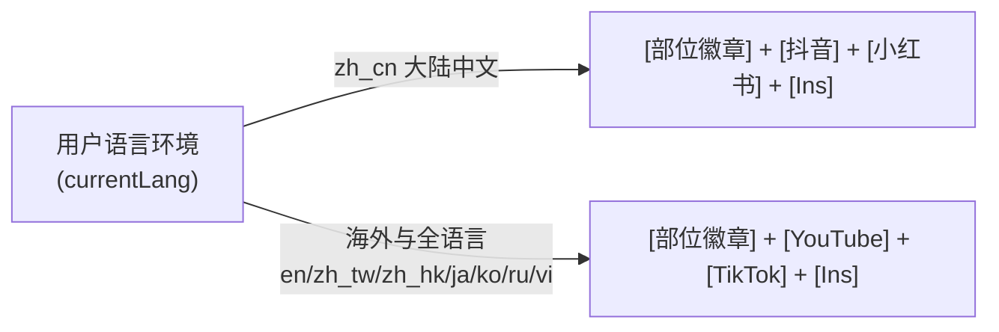

# 《你是细狗》DApp 全栈架构与动作库规范

> **定位**：纯 TON 架构 Web3 力量健身社区、无氧 300 动作大满贯动作库与双开门名人堂（`raw.xiaojiucai.pro`）权威白皮书。  
> **适用终端**：Telegram Mini App (`@rawscrawny_bot`)、iOS PWA、Android 带壳应用与桌面端。

---

## 一、 产品定位与核心价值观 (Product Identity & Philosophy)

### 1. 硬核工业风与极客调性 (Dark Obsidian, Zero AI Fluff)
* **曜石玄黑底色**：全站坚守硬核黑曜石背景色，强化肌肉视觉冲击力与器械质感，杜绝轻浮花哨与低质配色。
* **零 AI 模板痕迹**：严禁出现任何 Google / Gemini 风格的四角星星（`<Sparkles />`）、AI 魔法棒或泛滥的 Emoji 符号，全面采用健身专属活力火苗（`<Flame />`）与工业级排版胶囊。
* **极度克制的产品边界**：彻底排除升级打怪、段位蜕变、虚拟签到等冗余游戏化负担，只保留纯粹的训练记录、动作索引与真实身材资产沉淀。

### 2. 彻底拒绝虚浮花哨计时器 (Strict Self-Discipline Law)
* **无倒计时器扰动**：所有动作卡片严格按工业标准呈现，每组目标设定为 60 次自觉完成，**严禁添加任何强制倒计时器**。
* **节奏交还训练者**：训练节奏因人因时而异，倒计时只会徒增低端机能耗与打乱呼吸律动。

### 3. 双开门名人堂与自媒体流量闭环 (Double Door Club)
* **专注身材资产与去中心化认同**：聚焦博主肌肉展示、真实自律打卡与社交媒体（小红书、抖音、TikTok、YouTube、Instagram）多向引流。
* **去伪存真**：对网图、非本人、AI 虚假条目实行严格的前后端双重黑名单过滤与物理拦截。

---

## 二、 无氧 300 动作大满贯与解剖学动作库架构 (The 300 Anaerobic Exercises Canon)

### 1. 7 大无氧肌群 300 动作权威矩阵
系统在胸、背、肩、臂、腿、臀、核心 7 大无氧肌群上，历经严格解剖学筛选与生物力学微调，达成 **整整 300 个无氧动作**（另附 30 个自重有氧动作，全库总计 330 动作大满贯）：

| 部位分类 | 英文标识 | 动作总数 | 核心器械覆盖 | 动作库定点文件 |
| :--- | :--- | :---: | :--- | :--- |
| **胸部** | Chest | **47** | 杠铃、哑铃、龙门架绳索、双杠自重、器械 | `data/exercises/chest.ts` |
| **背部** | Back | **46** | 杠铃、哑铃、高位下拉、T杠地雷架、引体自重 | `data/exercises/back.ts` |
| **肩部** | Shoulders | **45** | 哑铃、杠铃推举、绳索飞鸟、俯斜凳、自重倒立 | `data/exercises/shoulders.ts` |
| **手臂** | Arms | **44** | 曲杆、哑铃、绳索下压、牧师凳、俯卧斜凳 | `data/exercises/arms.ts` |
| **腿部** | Legs | **46** | 深蹲架、倒蹬机、哈克机、腿屈伸、自重离心抗阻 | `data/exercises/legs.ts` |
| **臀部** | Glutes | **40** | 专用臀推机、史密斯机、地雷架、绳索外展、自重跪姿 | `data/exercises/glutes.ts` |
| **核心** | Core | **32** | 龙门架抗旋转、平凳抗屈曲、真空吸附自重、健腹轮 | `data/exercises/core.ts` |
| **合计** | **Anaerobic** | **300** | **全矩阵多语言覆盖，杜绝同义李鬼，解剖学零错位** | `data/exercises/index.ts` |

### 2. 21 大解剖学进阶高收益变式条目与生理机制
针对进阶训练者与生物力学优化需求，动作库特设 21 个经典黄金变式：

1. **胸部 (Chest +3)**：
   - **吉隆达双杠臂屈伸 (Gironda Dips)**：宽握肘外展、含胸乌龟背，自重极致孤立胸肌下外沿撕裂拉伸。
   - **地板卧推 (Floor Press)**：大臂触地截断肌腱牵张反射，纯向心发力爆破推胸中段粘滞点。
   - **六角哑铃挤压推 (Hex Press)**：双铃死命对压内夹推起，胸肌中缝产生极限向心充血。
2. **背部 (Back +3)**：
   - **米道斯地雷架划船 (Meadows Row)**：地雷架过手单臂外展弧线力矩，上背与大圆肌爆发轰炸，下背腰椎零剪切。
   - **海豹划船 (Seal Row)**：高平凳俯卧悬空划船，100% 杜绝蹬地借力与下背代偿，纯粹孤立中背与背阔肌。
   - **吉尔索俯斜耸肩 (Kelso Shrug)**：直臂上斜俯卧纯靠肩胛骨后缩下沉，精准孤立中下斜方肌与菱形肌。
3. **肩部 (Shoulders +3)**：
   - **吕小军大平举 (Lu Raises)**：360度大圆弧直抵头顶，激惹中束并极大强化肩胛上回旋与肩峰灵活性。
   - **埃及式绳索侧平举 (Egyptian Lateral Raise)**：斜倾身体使拉力方向与侧束肌纤维完美平行，全行程零死点受力。
   - **Y字俯斜平举 (Incline Y-Raise)**：45度俯斜手臂呈30度Y字展臂，精准唤醒下斜方肌，矫正圆肩驼背神器。
4. **手臂 (Arms +3)**：
   - **蜘蛛弯举 (Spider Curl)**：上斜凳反面胸趴垂直悬空弯举，完全阻断晃动借力，二头肌短头顶峰极度痉挛。
   - **泰特推举 (Tate Press)**：平凳双铃胸前合拢外展屈肘伸展，力量举大师私藏的三头肌外侧头杀手锏。
   - **佐特曼弯举 (Zottman Curl)**：向心反握顶峰转腕180度正握超慢速离心下放，二头肌与前臂肱桡肌一箭双雕。
5. **腿部 (Legs +3)**：
   - **西斯深蹲 (Sissy Squat)**：膝关节前顶、躯干后仰成直线，自重极限拉长股直肌产生核爆级股四头肌泵感。
   - **北欧腘绳肌弯举 (Nordic Curl)**：固定脚踝膝关节离心下俯，后侧链力量之王，强化膝盖抗伤病黄金法则。
   - **哥萨克深蹲 (Cossack Squat)**：超宽站距全幅度单腿侧蹲，对侧腿伸直脚尖朝天，兼顾单腿力量与内收肌柔韧。
6. **臀部 (Glutes +3)**：
   - **青蛙泵感臀桥 (Frog Pumps)**：脚底相对膝外展呈青蛙腿，彻底关停大腿四头肌与腘绳肌代偿，专治臀肌失忆。
   - **地雷架单腿硬拉 (Landmine Single-Leg RDL)**：单臂持地雷架弧线轨迹大幅提高单腿稳定性，深层拉伸臀大肌与臀中肌。
   - **消防栓式侧抬腿 (Fire Hydrant)**：四足跪姿向侧上方90度抬腿，精准孤立臀中肌与上臀边缘，填平假胯宽凹陷。
7. **核心 (Core +3)**：
   - **李小龙龙旗 (Dragon Flag)**：仅以上背为唯一支点全身笔直升降，李小龙标志性绝技，核心抗屈曲终极试炼。
   - **帕洛夫抗旋转推 (Pallof Press)**：侧对绳索向胸前平推，身体静止抵抗侧向扭转，骨盆腰椎零剪切力的防伤深层核心动作。
   - **古典真空腹内缩 (Stomach Vacuum)**：排空肺部强力抽吸肚脐贴向脊柱，直接激活深层腹横肌，打造古典健美极致窄腰。

### 3. 全球化 12 语种矩阵与 100% 双向对齐规范 (12-Language Global Matrix Canon)
系统与动作库完整接入 12 种主流国家与地区语言：
- 简体中文 (`Language.ZH_CN`)
- 繁体中文 (`Language.ZH_TW`)
- 英文 (`Language.EN`)
- 日文 (`Language.JA`)
- 韩文 (`Language.KO`)
- 俄文 (`Language.RU`)
- 港澳粤语 (`Language.ZH_HK`)
- 越南语 (`Language.VI`)
- 西班牙语 (`Language.ES`)
- 葡萄牙语 (`Language.PT`)
- 法语 (`Language.FR`)
- 印尼语 (`Language.ID`)

* **100% 双向对齐严苛测试标准 (`npm run test:i18n`)**：
  - 基准 206 个国际化词条全量覆盖；
  - 自动化测试脚本遍历所有 12 国语言字典文件（`src/i18n/locales/*.ts`），双向比对验证零多余孤立键、零缺失翻译键，彻底消灭渲染 undefined 导致的空白异常。
* **Header 国际化品牌差异化定调**：
  - **中文语系 (`zh_cn`, `zh_tw`, `zh_hk`)**：采用中英双行品牌标识（“你是细狗 / 你是細狗” + “YOU ARE SCRAWNY”）；
  - **其余 9 大国际语种 (`en`, `ja`, `ko`, `ru`, `vi`, `es`, `pt`, `fr`, `id`)**：统一仅展示高品质英文品牌名称（“YOU ARE SCRAWNY”），消除海外非中文用户的认知壁垒，提升全球化品牌质感。

### 4. 动态部位关键词自媒体精准教学跳出铁律 (Body Part Search Prefix Law)
* **痛点**：若仅用动作名称搜索，易搜索出同名歌曲、影视角色或模糊视频。
* **前置部位关键词铁律**：无论是调起原生 App Scheme 还是静默写入系统剪贴板，动作名称前**必须动态强制前置部位国际化名称**：
  - 中文抖音搜索：`"${bodyPartName} ${cleanZhName} 教程"`（如：`胸部 杠铃平板卧推 教程`、`背部 米道斯地雷架划船 教程`）
  - 英文 YouTube 搜索：`"${bodyPartName} ${enName} tutorial"`（如：`Chest Barbell Bench Press tutorial`）
  - TikTok 搜索：`"${bodyPartName} ${enName} form"`（如：`Chest Barbell Bench Press form`）
* **移动端零白屏跳出规范**：在 iOS / Android / PWA / 带壳 APK 环境下，YouTube 100% 采用系统原生 Scheme（`youtube://` / `vnd.youtube://`），**严禁在移动端弹窗使用 `window.open` 或弹出多余 Web 标签页**，杜绝用户切回 DApp 时面对空白卡死页面。

---

## 三、 Telegram Mini App 深度集成与全环境体验 (Telegram Mini App & PWA Architecture)

### 1. Telegram Mini App 环境物理静默规范
* **环境嗅探依据**：通过 `window.Telegram.WebApp.initData`、`window.TelegramWebviewProxy` 或 URL 中的 `tgWebApp` 字段精确识别。
* **物理隐藏存桌面**：在 Telegram Mini App 原生运行环境内，**100% 物理隐藏“存至桌面”悬浮按钮与弹窗**，彻底杜绝多余的安装引导干扰，保持原生小程序的轻量无感。

### 2. Telegram 内置浏览器 (In-App Browser) 智能转化
* **动态浮标切换**：当检测到用户在 Telegram 内置浏览器中打开 Web 页面时，右下角悬浮按钮自动转化为精致的 **`[ ✈️ TG 小程序 ]`**。
* **一键唤醒**：点击直接呼出 Telegram 小程序专属卡片，提供【一键开启 Telegram 小程序】快捷按钮，直达 `@rawscrawny_bot`，引导用户无缝流转至官方小程序。

### 3. 多端分流适配全景
* **iOS 原生 Safari**：提供极简 2 步图文引导（底部分享 -> 添加到主屏幕）。
* **iOS 第三方浏览器 (Chrome / Edge / Firefox)**：由于苹果系统权限限制无法直接添加，提供【一键复制并在 Safari 打开】快捷按钮。
* **Android 移动端**：提供标准 PWA 快捷方式引导与官方高速 APK 直链双通道。
* **独立运行模式 (Standalone / Capacitor 原生壳)**：100% 静默无感，桌面端默认不骚扰。

---

## 四、 纯 TON Web3 底座与动态会员验权 (Pure TON & Club Pass Dynamic Verification)

### 1. 彻底剥离 EVM / L2 冗余
* 专精于 TON (The Open Network) 公链生态，彻底剥离 ETH / EVM / L2 冗余依赖与 RPC 探针，保持 Telegram 原生 Web3 的极致轻量。

### 2. 三阶段生命周期闭环
1. **Gram 钱包登录与身材打卡提交**：用户连接 Gram / TON 钱包并提交打卡照；管理员后台人工审核通过后，该身材卡片与该 Gram 钱包地址永久物理绑定。
2. **链上动态验权 (Hold-to-Earn)**：前端及探针通过 TonCenter NFT API 实时查询该钱包地址是否持有官方 Club Pass 会员 NFT（优先查询 V2 主合约 `EQAOgV_jpZ6YK0ZypEp4oTgAa4T_QZafNN-Or0RSHs3S0Q3a`，未命中平滑回退查询 V1 历史合约 `EQA3amxHgmiMCBO5ijKij-mHxaJ_dxow-zbNnGEGkVXPlKRm`）。只要持有，全网即刻点亮金色尊贵 VIP 动态流光边框并开启 100% 粉丝打赏直通通道。
3. **资产转移即时失活 (Revoke-on-Transfer)**：一旦会员 NFT 被转出或在二级市场售出，系统毫秒级感知失活，全网自动立即剥夺 VIP 徽标并关闭直通打赏通道，无静态身份残留。

### 3. 创作者扫码专属受邀置顶
* 已入驻名人堂的创作者专属打卡海报生成专属二维码：`https://raw.xiaojiucai.pro/?tab=club&cardId=${card.hash}`。
* 好友或粉丝扫码进站后，系统毫秒级感知并将该卡片置顶至首位，点亮「**专属受邀 · 好友身材秀**」金色流光光环，并平滑居中滚动，实现自媒体跳转与打赏一键直达。

### 4. 2K 视网膜 9:16 标准打卡海报与胶囊排版微米级规范
* **严格 9:16 黄金竖屏规格**：海报 DOM 容器定点于 `width: 720px, height: 1280px`（`min-height: 1280px, max-height: 1280px`），通过 `html2canvas`（scale: 2）导出 `1440x2560` 2K 视网膜超清竖屏，完全贴合主流短视频平台（微信朋友圈、抖音、小红书、Instagram Stories、Telegram）9:16 竖屏全屏视觉流。
* **胶囊与字体微米级衔接**：
  - 胶囊统一采用确定性高度约束（头部认证胶囊 40px、充血状态胶囊 38px、部位胶囊 38px、做功量等价胶囊 44px、链上存证微胶囊 28px），结合 `border-radius: 9999px`（`rounded-full`）与 `leading-none`；
  - 彻底剥离原生 Emoji（`⚡`、`💥` 等由独立 CSS 发光脉冲指示点替代），杜绝系统字体导致的基线高度偏移与行距抖动；
  - 核心数值采用 Oswald 54px 倾斜加粗体配金红双色发光滤镜，与背景浅印暗纹（4% 透明度）形成清晰的前景与纵深层次。

---

## 五、 前端性能极限与 J3710 硬件零开销铁律 (Performance & Zero-Compute Law)

### 1. J3710 弱电硬件绝对零计算铁律
* **硬件防护**：生产服务器 Intel J3710 功耗仅 6W，**绝对严禁在 J3710 上执行任何 `npm run build`、`cargo build` 或重型计算**！
* **Mac mini M2 独揽 100% 编译算力**：所有静态检查、Vite 构建与预压缩 100% 必须在本地 Mac mini M2 完成。

### 2. 全量双重预压缩 (Brotli/Gzip) 零拷贝直发
* 本地构建完成后，自动对 `dist/` 内所有 `.js`、`.css`、`.html`、`.webmanifest` 产物并行执行 `brotli -q 9` 与 `gzip -9` 生成 `.br` 与 `.gz` 静态文件。
* rsync 原子推流至生产服务器后，Nginx 通过 `brotli_static on;` 与 `gzip_static on;` 实现纯内核零拷贝直接发送，彻底消除 Nginx 动态压缩的 CPU 开销。

### 3. Web3 SDK 异步懒加载分包
* 将庞大的 `@tonconnect/ui-react`（1.2MB+）彻底从首页入口剥离，封装为异步懒加载组件 `TonConnectWrapper.tsx`。
* `vite.config.ts` 拦截 `modulePreload`，确保首页首包 Brotli 压缩后严格控制在 **50KB~60KB** 极低水位，实现 **0ms 秒开**。

### 4. Safe IPFS 原生流式加载与 4 级网关降级
* 严禁使用 `fetch(blob) -> URL.createObjectURL` 将多张高清大图全量读入内存（避免低端设备 OOM 闪退）。
* 强制使用原生 `` 流式渲染。
* 配置 4 级网关竞速降级：`Pinata 专有网关 -> dweb.link -> cloudflare-ipfs.com -> ipfs.io`，看门狗 4.5 秒自动降级。
* Service Worker 升级为 v3 架构，显式捕获并离线缓存跨域图片流（`opaque response`），实现身材照一次下载、永久离线秒开。

### 5. 全域小文件解耦架构 (严格单文件 <250 行)
* 全工程所有 TS/TSX 源代码文件强制解耦并严格控制在 **250 行以内**，单一职责，杜绝修改引发的隐蔽副作用。
* `index.tsx` 顶层常驻 `GlobalErrorBoundary`，全域拦截任何未捕获异常，彻底消灭全白死屏。

---

## 六、 自动化流水线与生产运维 SOP (DevOps SOP)

### 1. 唯一标准化本地发布命令
在 Mac mini M2 本地直接执行部署脚本：
```bash
cd /Users/hi/niuma/projects/rawxiaojiucai
./deploy.sh "feat: commit 提交信息"
```
流水线自动执行：
1. 本地代码 Rebase 拉取；
2. Mac M2 本地 Vite 极速构建打包与 Brotli / Gzip 预压缩（~4 秒）；
3. Git 自动提交并推送到 GitHub 远端；
4. `rsync -avz --delete dist/` 零编译原子同步至 J3710 生产目录 `/home/a/dapp/rawxiaojiucai/dist/`；
5. SSH 远程平滑重载 Nginx（`sudo nginx -t && sudo systemctl reload nginx`）。

### 2. XGBot 本地微服务运维
```bash
# 查看 XGBot 微服务运行状态 (严格限制 MemoryMax=100M)
ssh a@192.168.1.182 "systemctl status dapp_xgbot.service --no-pager"

# 查看最近日志
ssh a@192.168.1.182 "journalctl -u dapp_xgbot.service -n 50 --no-pager"

# 重启微服务
ssh a@192.168.1.182 "sudo systemctl restart dapp_xgbot.service"
```

---

## 七、 2K Retina 战神战报海报与 12 国语言裂变矩阵架构 (2K Retina Poster Canon)

### 1. 社交裂变超大字体与视觉冲击力
* **移动端开图秒读**：彻底消灭移动端小字体。吞铁做功与连击数据采用 **52px Oswald 巨型数字**，战力评级 38px，主标题 30px，徽标 16px，二维码 110px 配合 3px 琥珀金立体外框。
* **单行不折断**：核心战斗标题与部位标签强制执行 `white-space: nowrap; flex-shrink: 0;`，彻底消除由于文字过长导致的尴尬孤字换行。

### 2. 100% 纯净语言单轨隔离 (Pure 12-Language Matrix)
* 支持中简 (`ZH_CN`)、中繁 (`ZH_TW`)、中港 (`ZH_HK`)、英 (`EN`)、日 (`JA`)、韩 (`KO`)、俄 (`RU`)、越 (`VI`)、西 (`ES`)、葡 (`PT`)、法 (`FR`)、印尼 (`ID`) 共 12 种语言。
* 彻底实现 100% 纯净语言单轨隔离：选英文时全英文，选中文时全中文，绝不夹杂中英文混排。

### 3. 动态部位感知与解剖图发光联动 (Dynamic Anatomical Glow)
* 自动提取当日训练所有部位（如“腿部 + 臀部” / "LEGS + GLUTES"），并在 SVG 解剖剪影（`PosterMuscleFigure.tsx`）上精确点亮对应肌群（股四头肌/腘绳肌发光赤红，臀大肌发光琥珀金，上肢/胸肌/背肌按需高亮）。
* 水印背景与单日战斗总结动态展示组合部位。

### 4. Web3 品牌宣发定调
* 底部背书统一为：`官方链上永久存证 · 无国界0抽水社交打赏` / `ON-CHAIN PERMANENT PROOF · ZERO-FEE GLOBAL SOCIAL TIPPING`。

### 5. 严格五小文件解耦架构 (严格 <250 行)
* `components/WorkoutPoster.tsx` (200行)：海报主入口、原生分享 API 调度、相册保存与移动端交互。
* `components/WorkoutPosterCard.tsx` (149行)：720px 2K Retina 海报 DOM 纯净渲染。
* `components/PosterMuscleFigure.tsx` (139行)：解剖学肌肉发光动态 SVG 矢量组件。
* `components/posterHelpers.ts` (143行)：部位提取、做功吨位计算、8国语言战斗标题与文案生成。
* `components/posterI18n.ts` (18行 + 子模块)：12国语言海报词典与本地化映射。

### 6. 7 大肌群与有氧专属解剖发光色彩矩阵 (Anatomical Chromatic Canon)
* **手臂 (Arms / 麒麟臂)**：双臂肱二头肌、肱三头肌与前臂肌群呈核聚变双色渐变高亮（琥珀金 `#f59e0b` ~ 爆破红 `#ef4444`），浮水印透射「麒麟臂峰爆」，副标题深度撕裂肱二三头肌纤维；
* **腿部 (Legs)**：股四头肌与腘绳肌点亮赤红发光渐变（`#ef4444` ~ `#991b1b`），下肢钢铁泰坦；
* **臀部 (Glutes)**：臀大肌与臀中肌点亮尊贵琥珀金渐变（`#f59e0b` ~ `#b45309`）；
* **胸部 (Chest)**：左右胸大肌上中下束点亮爆裂赤红，主攻双开门维度；
* **背部 (Back)**：斜方肌与倒三角背阔肌点亮金色光芒，强化钢铁脊梁；
* **肩部 (Shoulders)**：左右三角肌前中后束立体点亮，塑造南瓜肩；
* **核心 (Core)**：腹直肌与腹外斜肌雕刻点亮；
* **有氧 (Cardio)**：中心动力核与血流循环节点呈天青冰蓝（`#38bdf8`）核爆光效。

### 7. Telegram 2K 视觉走查与真机推流 SOP (Telegram Visual Verification SOP)
在开发或迭代海报时，通过 Chrome Headless 2K 渲染并极速推流至命主 Telegram 进行真机视觉把控：
```bash
# 1. Mac 本地 Chrome Headless 2K Retina (1440x2560) 渲染
"/Applications/Google Chrome.app/Contents/MacOS/Google Chrome" \
  --headless=new --disable-gpu --window-size=720,1280 --force-device-scale-factor=2 \
  --screenshot=/path/to/poster.png --virtual-time-budget=2000 \
  file:///path/to/poster.html

# 2. 调用 Telegram 专用推流工具秒级推送至命主手机
/Users/hi/niuma/bin/tg_send_file "/path/to/poster.png" "战报海报视觉走查"
```

---

## 八、 Web3 动态验权、打赏闭环与移动端沙箱工程规范 (Web3 & Mobile Engineering Standards)

### 1. 双轨打赏与 80%/20% 商业分成架构 (Dual-Track Tipping & Platform Fee Split)
* **业务铁律**：
  1. **普通创作者（绑定收款钱包）**：无需持有 NFT，只要已绑定有效 TON 钱包，即可激活链上赞赏通道。打赏转账由底层 `tipSplitHelper.ts` 执行多跳拆分：
     - **创作者实收 80%**：直接打入创作者收款地址；
     - **平台生态服务费 20%**：直接打入董事长金库 `UQBbPM8jUI5deUK0ZmnBludIL1SUBPrpp6k-BSyZukUstM_j`（携带 Memo `XG:EcoFund-20%`）；
     - 瀑布流卡片打赏按钮标注清晰的 `80%` 角标，保障财务透明与分成共识；
  2. **Club Pass NFT 尊贵持卡者 (VIP)**：
     - 动态检测持仓状态（优先检测 V2 主合约 `EQAOgV_jpZ6YK0ZypEp4oTgAa4T_QZafNN-Or0RSHs3S0Q3a`，未命中平滑回退检测 V1 历史合约 `EQA3amxHgmiMCBO5ijKij-mHxaJ_dxow-zbNnGEGkVXPlKRm`）；
     - 享 **100% 全额秒到账**（0% 平台服务费）+ 黑金流光卡片与专属认证；
  3. **未绑定钱包的纯游客模式**：仅用于身材展示与社媒引流，前端隐去打赏按钮，绝不在无目标地址时发起无效交易。
* **三位一体严密管控**：
  1. **瀑布流卡片 (`FeedItem.tsx`)**：仅当创作者具有有效地址时才挂载打赏胶囊，非 VIP 标注 `80%`，VIP 呈现尊贵高亮；
  2. **大图浮层灯箱 (`ClubLightbox.tsx`)**：未绑定钱包创作者明确提示“仅作展示”，有钱包者提供无缝赞赏入口；
  3. **打赏弹窗二次深度防御 (`TipModal.tsx`)**：多跳交易参数严格对齐，禁止溢出与负数计算。
* **统一地址归一化与冷热分级缓存 (`services/membershipService.ts`)**：
  - 无论传入 `EQ`、`UQ` 还是 `0:`，统一通过 `normalizeTonAddress` 转为小写 Raw Hex (`0:xxx`) 作为唯一缓存与查询 Key；
  - 正向持仓（`isVip: true`）缓存 7 天；负向未持仓（`isVip: false`）缓存 10 分钟（让刚购买 NFT 的创作者尽快生效）；
  - In-flight Promise 并发去重，杜绝瀑布流同时触发重复的 TonAPI 请求。

### 2. 移动端 WebKit 离屏渲染与内存沙箱法则 (WebKit Offscreen & Memory Safety)
* **严禁 `-9999px` 离屏定位**：iOS Safari / Telegram WebView 在视口裁剪优化下，对 `-9999px` 的超远 DOM 会剔除渲染管线，导致 `html2canvas` 导出纯黑/空白海报。必须置于视口内不可见层 (`position: fixed, left: 0, top: 0, opacity: 0.01, zIndex: -100`)。
* **Blob URL 内存成对销毁**：使用 `URL.createObjectURL` 预览身材照时，必须在重新选图、提交成功与组件卸载生命周期成对执行 `URL.revokeObjectURL`，避免大图内存堆积引发移动端 WebView 闪退。
* **编辑态槽位防塌缩错位**：多下拉框计划管理器在编辑态严禁直接 `filter(p => p !== 'None')` 导致数组长度收缩，必须保持槽位绝对固定，仅在最终保存时执行清洗。
* **BigInt 运算异常防御**：对外部数据（如 Hash、时间戳等）使用 `BigInt()` 转换必须包裹 `try-catch`，防范非十进制字符串抛出 `SyntaxError` 击垮全局视图。

---

## 九、 动作教程按地域精准分流与三平台自适应架构 (Regional 3-Platform Tutorial Architecture)

### 1. 4 列 Bento 黄金网格与严苛平台选拔原则
动作训练卡片顶部（`ExerciseCard.tsx`）采用固定 **4 列极简 Bento 网格**（`[部位徽章] + [平台1] + [平台2] + [平台3]`），单行永不折行，各语言环境严格锁定 3 个最高品质平台：



* **严格 3 平台上限**：彻底剔除信息过载，保障组间 60 秒休息期秒级看懂动作；
* **低质平台绝对物理隔离原则**：
  - **快手**：严重破坏品牌硬核黑曜石调性与健身美学，坚决弃用；
  - **Bilibili (B站)**：平均 15 分钟的长视频结构与前置长广告不符合健身房即时组间纠错场景，坚决弃用；
  - **Google Video**：零社交属性与审美活力，坚决弃用。

### 2. 精准地域分流与交互矩阵
| 区域模式 | 平台 1 (左) | 平台 2 (中) | 平台 3 (右) | 核心优势与视觉定调 |
| :--- | :--- | :--- | :--- | :--- |
| **🇨🇳 大陆简体 (`zh_cn`)** | **抖音 (Douyin)**<br/>`snssdk1128://search?keyword={动作} 教学` | **小红书 (Xiaohongshu)**<br/>`xhsdiscover://search/result?keyword={动作} 动作教学` | **Ins (Instagram)**<br/>`instagram://tag?name={cleanTag}` | 抖音青色音符 + 小红书薯红微书本 + Ins 幻彩粉；小红书深耕博主发力细节，Ins 定位国际审美 |
| **🌍 海外全语言 (`en` 等)** | **YouTube**<br/>`youtube://results?search_query={动作} tutorial` | **TikTok**<br/>`snssdk1233://search?keyword={动作} tutorial` | **Instagram (Ins)**<br/>`instagram://tag?name={cleanTag}` | 经典红 + 霓虹粉 + 幻彩粉；覆盖全球顶尖健美博主视频库与 Reels |

### 3. Instagram 动作标签直达与剪贴板自动复制闭环 (Instagram Tag Deep Link Protocol)
* **技术突破**：针对 Instagram 客户端缺乏通用关键词全文搜索 Scheme 的限制，采用“动作标准标签直达 + 剪贴板自动预置”闭环协议：
  1. **标签推导**：自动提取动作的标准英文名称并格式化为纯净字母标签 `cleanTag`（如 `Barbell Bench Press` -> `barbellbenchpress`，`Squat` -> `squat`，`Lat Pulldown` -> `latpulldown`）；
  2. **移动端 Scheme 唤醒**：直接拉起 `instagram://tag?name=${cleanTag}`，直达该动作的全球顶尖健身模特与运动员 Reels 视频流；Web 端平滑降级为 `https://www.instagram.com/explore/tags/${cleanTag}/`；
  3. **剪贴板双保险复制**：点击瞬间后台异步将动作名写入剪贴板，并触发轻量级 Toast（“已复制「动作名」，已为您直达 Ins #tag！”），用户如需搜索特定作者只需长按粘贴。

### 4. 训练卡教程与名人堂社媒双轨独立规范 (Dual-Track Independence)
* **单卡教程**：严格遵守上述地域分流与 3 平台规则，专注即时训练纠错；
* **双开门名人堂 (DoubleDoorClub)**：创作者 UGC 个人社交主页名片保持 100% 全球化互通（覆盖 TikTok、Instagram、YouTube、抖音、小红书、Telegram 等），绝不因训练卡语言而缩减，保障全球创作者商业曝光与跨平台引流权益。

---

## 十、 双通道高转化钱包引导与系统工程防御规范 (Dual-Channel Wallet & FullStack Engineering Canon)

### 1. 双通道高转化钱包架构与返佣闭环 (`TonTutorialModal.tsx`)
* **彻底剔除币安 Web3 钱包**: 
  - 旧版本教程中包含的币安 Web3 钱包（Binance Web3 Wallet）无法统计专属引流返佣，导致高价值 Web2 独立 App 用户白白流失至无收益竞品；
  - 现已彻底将币安钱包从全站及教程弹窗中物理拔除，消灭流量黑洞。
* **PM 级双通道高转化漏斗**:
  1. **通道一：Telegram 原生钱包 (`@wallet`) 0 下载秒开**
     - 适用场景：Telegram Mini App 亿级原生用户；
     - 核心优势：无需下载任何独立 App，0 门槛开通，直接连通 Telegram 原生生态。
  2. **通道二：官方首推 Bitget Wallet（邮箱 MPC 极简注册 + 专属返佣）**
     - 适用场景：独立 Web / iOS PWA / Android APK 外部用户；
     - 核心优势：支持 Web2 邮箱与社交账号 MPC 登录，彻底打消小白用户对 24 位助记词丢失的恐惧心理；
     - **返佣闭环**：官方链接 100% 绑定命主专属推荐邀请码（`KeNw3s` / `inviteCode=KeNw3s`），实现独立流量的深度沉淀与终身返佣变现。
  3. **防诈安全卡片与助记词铁律**：保留防诈安全卡片与冷钱包备份指引，全教程由 3 张精简卡片组成，轮播平滑，单文件严格控制在 216 行。

### 2. 移动端 History 栈防死锁与 Popstate 看门狗规范 (`App.tsx`)
* **移动端历史栈竞态痛点**：在移动端浏览器与 Android PWA 环境中，当多个顶层模态框（如打卡弹窗、钱包教程、名人堂灯箱）交替打开时，若无脑调用 `window.history.pushState`，会导致历史栈重复入栈、产生多余假历史记录；当用户执行 Android 物理返回键或侧滑手势时，页面陷入反复关闭弹窗却退不出 App 的死锁。
* **单状态防护守卫**：
  ```typescript
  if (!window.history.state?.xgAppModalOpen) {
    window.history.pushState({ xgAppModalOpen: true }, '');
  }
  ```
* 配合顶层 `window.addEventListener('popstate')` 统一派发，确保每次弹窗触发只占用单层历史步长，物理返回键能平滑、精准地按顺序关闭模态框。

### 3. 社交调度单一职责与 Rule 17 严格解耦 (Creator Social Launcher Modularization)
* **小文件单一职责法则**：为坚守全工程单文件严格 <250 行底线（Rule 17），将社交调度模块精准拆分为两个独立文件：
  - `utils/creatorSocialLauncher.ts`（108 行）：专职负责双开门名人堂（DoubleDoorClub）博主全平台个人主页客户端唤醒与手势复制（TikTok、Instagram、YouTube、抖音、小红书、Telegram）；
  - `utils/socialLauncher.ts`（216 行）：专职负责动作卡片（ExerciseCard）多平台教学视频精确检索与 Instagram #tag 直达；
* 两大模块各司其职，彼此解耦，从物理层面根除了单文件代码膨胀的隐蔽缺陷。

### 4. 计划管理多下拉槽位动态复合键稳定性 (Stable Slot Key Standard)
* **动态槽位复用痛点**：在 `WorkoutManager.tsx` 和 `CardioManager.tsx` 动态多部位与有氧槽位配置中，若直接使用数组下标 `key={idx}`，当用户在中间插入、删除或调整训练部位时，React Virtual DOM 会复用旧组件内部的 DOM 状态，导致下拉框选中的部位发生错位（Array Shift Glitch）。
* **复合键标准化解决方案**：统一升级为基于所属星期与槽位序号的复合稳定键：
  ```tsx
  key={`workout-slot-${day}-${idx}`}
  ```
  彻底杜绝下拉选择框状态脱节，确保用户定制计划编辑态绝对稳定。

---

## 十一、 双开门名人堂中央注册表 2.0 链上存证与自动化运维规范 (HallOfFameRegistry 2.0 & Headless Ops)

### 1. 合约定点与 TVM 架构
* **主网合约地址 (Bounceable)**: `EQDJQcb-1K6W7LCowAqTXvrYXHfdyVsRban8oQw9RrZntGka`
* **主网合约地址 (Non-bounceable)**: `UQDJQcb-1K6W7LCowAqTXvrYXHfdyVsRban8oQw9RrZntDTf`
* **TVM 特性**: 基于 Tact 1.6 编写，支持 `members: map<Int as uint256, MemberEntry>` O(1) 毫秒级单点查询，全量状态变更在链上通过 `emit(MemberSetEvent{...})` 抛出事件存证。
* **RBAC 权限分级**:
  - **所有者 / 董事长 (Chairman)**: `UQBbPM8jUI5deUK0ZmnBludIL1SUBPrpp6k-BSyZukUstM_j`，拥有最高金库提取权与管理员任命权；
  - **W5 自动化管理员**: `UQCqQVeGQ_90SBai5TjiuA0u-serd-IMg9luyeFeWRngHa8E`（`isAdmin: true`），专职用于 TG Bot 审核同意后的后台秒级签名上链；
  - **原班俱乐部管理员**: 4 位原班管理员同步激活，协同保障社区审核。

### 2. 自动化运维工具链 (`scripts/`)
1. **状态点查 (`ops_query.ts`)**: 实时监控合约激活状态、金库余额、已存证创作者总人数 (`total_members`) 与管理员状态；
2. **成员上链与封禁 (`ops_member.ts`)**:
   - `set`: 录入或更新创作者 UID、IPFS CID、平台、社交 Handle、宣言与收款钱包；
   - `block`: 快速熔断封禁（0）或解封（1）违规内容，免去重新部署合约成本；
3. **金库安全提现 (`ops_treasury.ts`)**:
   - 合约底层强制保留 `0.05 TON` 租金底池（`nativeReserve`），杜绝因提空导致合约欠费冻结；
   - 盈余资金一键生成 Tonkeeper 深层提款链接，直达董事长金库。

---

## 十二、 海报全屏渲染、客户端实拍照微压缩与 PWA 静默热更规范

### 1. 海报视口绝对坐标对齐（消除 Flexbox 预变换偏移死锁）
* **错误原点**：在固定小视口（如 340×604）缩放预览大画布（720×1280）时，外层容器严禁使用 `flex items-center justify-center` 搭配子元素 `transform: scale(0.472222); transformOrigin: top left`。
* **几何推导陷阱**：Flexbox 会在 CSS 变换前将 720×1280 子元素相对小容器居中布局（top-left 被推移至 `(-190px, -338px)`）；而随后的 `transform` 从该负坐标原点缩放，导致整个海报画面向左上方大范围偏移，在 `overflow: hidden` 视口中惨遭截断，用户只能看到右下角的一小撮区域。
* **法定正确定位范式**：外层容器声明明确像素（如 `w-[340px] h-[604px]`）并设为 `position: relative; overflow: hidden;`；内层 720×1280 画布强制采用 `position: absolute; top: 0; left: 0; width: 720px; height: 1280px; transform: scale(0.472222); transformOrigin: top left;`，将左上角严格锚定在 `(0, 0)`，彻底杜绝 Flex 居中预推移。

### 2. 实拍身材图双层混合渲染架构与 html2canvas 兼容
* **html2canvas 裁剪失效缺陷**：`html2canvas` 无法正确解析 ``，会将手机高分辨率实拍图（3000×4000+）从原图 `(0, 0)` 开始按 1:1 强行平铺，生成的海报只截取了照片左上角极小的一块（即“只剩一个角”）。
* **双层混合渲染解决方案**：
  - **底层（导出层）**：设置 CSS `background-image: url(...)` 配合 `background-size: cover; background-position: center;`，`html2canvas` 对 CSS background cover 的解析是 100% 完美的，保障 720×1280 高清画布居中铺满截取；
  - **上层（预览层）**：保留硬件加速的 `` 标签，并注入 `data-html2canvas-ignore="true"`，供浏览器高帧率预览的同时，防止在 Canvas 导出时二次覆盖未裁剪原图；
  - **滚动视口零漂移**：在 `html2canvas` 导出选项中显式注入 `x: 0, y: 0, scrollX: 0, scrollY: 0`，杜绝真机上下滑动页面后海报产生的黑边与切除。

### 3. 前端图片微压缩防 iOS Safari 288MB 显存崩溃
* **大图内存陷阱**：手机原生拍摄的 10MB~20MB 原图若直接通过 `FileReader.readAsDataURL` 转成 Base64，会膨胀至近 20MB 塞入 React 状态与 DOM，在 iOS Safari 调用 `html2canvas` 时极易瞬间击穿 WebKit 的 288MB Canvas/DOM 显存上限，导致页面瞬间闪退、黑屏或白屏重载。
* **前端微压缩防护**：在 `WorkoutPoster.tsx` 中引入 `browser-image-compression`，在转 Base64 之前自动将实拍图降采样至 1440P 并无损压至 350KB 以内，彻底根治真机发烫与内存溢出。

### 4. PWA 异步静默热重载与发版缓存自动化更新
* **消除 800ms abort 锁死旧版陷阱**：废除旧 Service Worker 中带有超时 abort 的请求覆盖机制，采用真正的 **Stale-While-Revalidate**：前台即使在弱网（>600ms）下先以本地缓存极速呈现，后台网络 fetch 也绝不断流，静默完成后写回 Cache Storage；
* **发版自动递增 CACHE_NAME**：在 `deploy.sh` 发布脚本中自动将构建时间戳注入 `public/sw.js` 的 `CACHE_NAME`（如 `xg-scrawny-offline-v${BUILD_TIMESTAMP}`），促使客户端 Service Worker 自动触发更新周期并废弃旧缓存，用户无须手动清除浏览器缓存。


