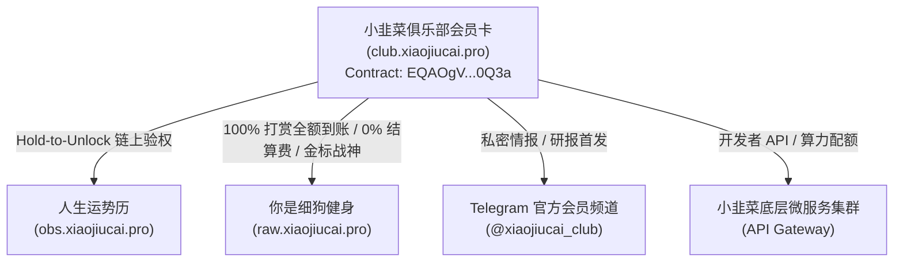
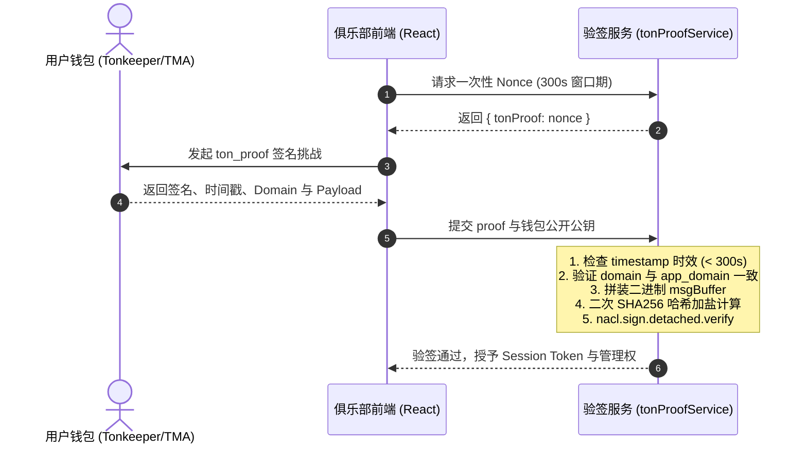

# 小韭菜俱乐部会员卡全栈架构与产品白皮书 (XiaoJiucai Club NFT Pass)

> **项目定点**：`club.xiaojiucai.pro`  
> **代码仓库**：`https://github.com/abei1121/clubxiaojiucai` (本地定点：`/Users/hi/Documents/GitHub/clubxiaojiucai`)  
> **智能合约**：  
> - **V2 主合约**: `EQAOgV_jpZ6YK0ZypEp4oTgAa4T_QZafNN-Or0RSHs3S0Q3a` (全生命周期运营、AdminMint、暂停开关、动态元数据与防 Gas 抽水)  
> - **V1 兼容合约**: `EQA3amxHgmiMCBO5ijKij-mHxaJ_dxow-zbNnGEGkVXPlKRm` (历史 23 张存量卡，待空投迁移完成后退役)  
> **适用终端**：Telegram Mini App (TMA)、iOS Safari/PWA、Android Chrome、桌面 Web 浏览器。

---

## 一、 产品定位与赛博草根人设 (Product Identity & Cypherpunk Persona)

### 1. 核心人设：“一个小人物 启” / 顽强的草根密码朋克 (The Resilient Grassroots Cypherpunk)
小韭菜俱乐部不是一个由 VC 操盘、西装革履的加密基金项目，而是一个有血有肉、在历次加密牛熊周期中被反复收割却从未倒下的“草根韭菜”的数字图腾：
* **去虚假繁荣，讲真实自嘲**：
  - 拒绝一切“颠覆行业”、“下一个以太坊”的宏大叙事与虚浮宣讲；
  - 以极度坦诚、自嘲幽默的姿态（“既然都是韭菜，不如抱团取暖”）面对用户。
* **反割韭菜，建永久特权**：
  - 传统 NFT 靠画饼割韭菜、发币后团队跑路；小韭菜俱乐部会员卡是**一次铸造、永久生效**的全生态实用型通行证 (Utility Pass)。
  - 持有者即拥有小韭菜全矩阵服务的一级公民权限（运势历高级推演、细狗名人堂极速认证、专属内部研报与生态空投）。
* **高端暗黑流体玻璃质感 (Dark Liquid Glass Luxury)**：
  - 视觉上采用高级黑曜石玄黑底色，辅以微光漫射的流体磨砂玻璃（Backdrop Blur）、香槟金/赛博绿渐变流光；
  - 营造出如同瑞士黑卡或加密私董会般的精致质感，将“草根自白”与“高级工业排版”形成强烈戏剧张力，让持有者产生由衷的归属感与身份荣誉感。

### 2. 生态闭环与特权继承矩阵 (Cross-DApp Utility Matrix)
小韭菜俱乐部会员卡不是孤立的信息孤岛，而是贯穿小韭菜宇宙所有 DApp 的统一主钥匙：



* **细狗名人堂 2.0 双轨特权**：
  - 非会员绑定钱包仅实收 80% 打赏，平台收取 20% 生态服务费；
  - **Club Pass 持有者尊享 0% 费率特权**，粉丝赞赏 100% 全额直达个人钱包，并点亮黑金流光外框与尊贵认证；
* **即时转出撤权机制 (Revoke-on-Transfer)**：
  - 各 DApp 校验权限时，必须直接向 TON RPC 打靶比对当前连接地址持有状态，杜绝利用本地 LocalStorage 静态缓存实施的“卡转出但权限残留”白嫖漏洞。

---

## 二、 智能合约与链上交互规范 (Smart Contract & On-Chain Specs)

### 1. 核心合约定点与网络拓扑
* **主网 V2 主合约**：`EQAOgV_jpZ6YK0ZypEp4oTgAa4T_QZafNN-Or0RSHs3S0Q3a` (全生命周期运营版)
* **主网 V1 兼容合约**：`EQA3amxHgmiMCBO5ijKij-mHxaJ_dxow-zbNnGEGkVXPlKRm` (历史 23 张存量卡)
* **地址标准化比对**：
  - 严禁在 JavaScript / TypeScript 中使用 `===` 直接比较反弹格式（`EQ...`）与非反弹格式（`UQ...`）或原始十六进制地址；
  - 必须通过 `@ton/core` 的 `Address.parse(a).equals(Address.parse(b))` 或统一函数 `isAddressEqual(a, b)` 标准化处理。

### 2. 链上转账与 Gas 费调配规范
* **非反弹地址铁律 (`bounceable: false`)**：
  - 所有普通用户铸造、打赏或向金库打款操作，目标地址必须声明为 `bounceable: false`，避免向未初始化合约/地址发送资金时遭遇回弹并白白磨损 Gas。
* **Gas 预留与 Exit Code -13 诊断**：
  - TON 虚拟机执行异常 `exit_code: -13` 通常由 **Gas 不足**（Out of Gas）或计算阶段抛出未捕获异常引发；
  - 铸造交易必须附带充足的 Gas 垫付（建议 `>= 0.05 TON`），富余 Gas 将由合约通过 `mode: 64` 携带剩余价值原路退回。

### 3. 多节点高可用 RPC 轮询与故障转移池
前端杜绝单一 RPC 依赖，采用动态多节点自动降级策略：
1. **主选**：`https://toncenter.com/api/v2/jsonRPC` (带 API Key)
2. **备选 1**：`https://go.getblock.io/.../mainnet/` (专有高吞吐网关)
3. **备选 2**：`https://ton.access.orbs.network/` (去中心化公共节点池)
4. **探针心跳**：连续 2 次请求超时（> 3.5s）或返回 HTTP 429/502 时，秒级无缝漂移至备选节点，保障高并发铸造时前端零挂起。

---

## 三、 TonConnect 2.0 签名鉴权与密码学安全闭环 (TonProof 2.0 Standard)

### 1. 传统伪签名漏洞与攻击面
历史遗留的前端实现常存在严重缺陷：
* 仅仅校验 `signature.length === 64` 即草率放行，导致攻击者构造任意 64 字节伪造 Hex 即可冒充合约管理员攻破管理面板；
* 构造待签名消息时错误使用 `'ton-safe-sign-magic'` 前缀，导致正规钱包（Tonkeeper、OpenMask）签名校验彻底失败。

### 2. 标准 TonProof 2.0 密码学验签算法
严格遵循 Telegram / TON 官方 TonConnect 2.0 安全标准：



#### 二进制拼装与双重哈希铁律：
1. **基础 Proof 结构拼装**：
   ```text
   msg = 'ton-proof-item-v2/' 
         ++ workchain (int32BE) 
         ++ addressHash (256BE) 
         ++ domainLength (uint32LE) 
         ++ domain (UTF-8) 
         ++ timestamp (uint64LE) 
         ++ payload (UTF-8)
   ```
2. **消息摘要计算**：
   ```typescript
   const msgHash = sha256(msg);
   ```
3. **前缀盐值拼接（铁律：必须为 `'ton-connect'`）**：
   ```typescript
   // 严格遵循 0xffff ++ 'ton-connect' 协议头，绝不能使用 'ton-safe-sign-magic'
   const fullMsg = Buffer.concat([
     Buffer.from([0xff, 0xff]),
     Buffer.from('ton-connect'),
     msgHash
   ]);
   ```
4. **最终摘要与 Ed25519 验签**：
   ```typescript
   const finalHash = sha256(fullMsg);
   const isValid = nacl.sign.detached.verify(finalHash, signature, publicKey);
   ```

---

## 四、 Telegram WebApp (TMA) 深度适配与环境沙箱规范 (TMA Sandbox)

### 1. TMA 环境 TonConnect 钱包穿透防锁死规范
* **核心陷阱**：在 Telegram Mini App 中，若前端检测到处于 Telegram 环境，误将 `tonProof` 设为 `{ state: 'ready', value: {} }`，会导致 Tonkeeper、MyTonWallet 等非 Telegram 原生钱包在弹窗中无法发起 TonProof 挑战。管理员连接钱包后无法获取签名凭据，被永久锁死在只读“观察模式”。
* **防御铁律**：无论环境是 TMA 还是标准 Web 浏览器，`useTonProof` 初始化必须始终提供 `tonProof: nonce` 参数，保障跨端签名行为绝对一致。

### 2. 外部链接穿透与安全跳板 (`openLink.ts`)
Telegram 内置 WebView 对普通 `<a>` 标签与 `window.open` 存在沙箱拦截：
* **跳转 Telegram 内部资产**（群组、频道、Bot）：必须优先调用 `Telegram.WebApp.openTelegramLink(url)`；
* **跳转外部网页**（Tonviewer 浏览器、官方网站）：必须调用 `Telegram.WebApp.openLink(url)`；
* **通用降级方案**：非 TMA 环境采用 `window.open(url, '_blank', 'noopener,noreferrer')`。

### 3. iOS WebKit 物理滚动穿透修复
* **禁止破坏性样式**：严禁在模态框打开时使用 `document.body.style.touchAction = 'none'`，这会导致 Safari 渲染管线卡死或全站无法恢复手势滚动。
* **正确规范**：统一采用 `document.body.style.overflow = 'hidden'`，并在组件卸载或模态框关闭时清理恢复。

---

## 五、 Cloudflare Pages 与 CI/CD 自动化构建矩阵 (Build & Deployment)

### 1. Tailwind CSS v4 与 Vite 6 的 Node 20 强依赖红线
* **构建故障根因**：项目采用 Tailwind CSS v4 与 Vite 6 构建，其底层的 LightningCSS 与全新编译器硬性要求 `Node.js >= 20.0.0`。
* **Cloudflare Pages 默认陷阱**：Cloudflare Pages 默认构建镜像预装的是 Node 18 或 12，若代码仓库未显式指明版本，将导致远端流水线解析 CSS 时直接崩溃，抛出语法错误或模块丢失。
* **根目录强制锁定规范**：必须在项目根目录同时配置两个版本锁文件：
  - [`.nvmrc`](file:///Users/hi/Documents/GitHub/clubxiaojiucai/.nvmrc): `20.18.0`
  - [`.node-version`](file:///Users/hi/Documents/GitHub/clubxiaojiucai/.node-version): `20.18.0`

### 2. 极速增量构建验收标准
* **Mac M2 本地构建**：`npm run build` 耗时应严格保持在 `<= 5.0s` 范围内；
* **构建产物零警告**：无 React 依赖死循环警告、无未使用的危险全局属性；
* **版本发布 SOP**：
  ```bash
  cd /Users/hi/Documents/GitHub/clubxiaojiucai
  npm run build           # 必须在本地先行验证通过
  git status              # 确认无未追踪或遗漏文件
  git push origin main    # 触发 Cloudflare Pages 自动化全球部署
  ```

---

## 六、 全栈 8 大深层缺陷排查与自愈日志 (8-Point Remediation Archive)

在 2026-10-01 针对 `clubxiaojiucai` 实施的深度审计中，全面清除以下 8 大隐蔽缺陷：

| 编号 | 缺陷分类 | 严重度 | 缺陷根因与破坏性 | 自愈策略与修复代码 |
| :--- | :--- | :---: | :--- | :--- |
| **01** | 安全鉴权 | **CRITICAL** | `tonProofService.ts` 误用 `'ton-safe-sign-magic'` 且存在 `signature.length === 64` 放行漏洞 | 重构为标准 TonProof 2.0 规范，强制使用 `0xffff ++ 'ton-connect'` 盐值与 Ed25519 公钥真实验签 |
| **02** | 平台适配 | **HIGH** | `useTonProof.ts` 在 TMA 环境中跳过 proof 生成，致使非 Telegram 钱包无法签名，管理员陷入只读锁死 | 彻底移除 TMA 特化旁路，统一声明 `{ tonProof: nonce }` 挑战 |
| **03** | CI/CD | **HIGH** | 缺少 `.nvmrc` 与 `.node-version` 导致 Cloudflare Pages 使用 Node 18 构建 Tailwind v4 持续报错失败 | 根目录补齐 `20.18.0` 锁文件，并提交安全链接跳板 `openLink.ts` 规避远端模块缺失 |
| **04** | React 性能 | **MEDIUM** | `useXiaoJiucaiClub.ts` 中 `fetchContractData` 未用 `useCallback` 稳定引用，导致 `useEffect` 无限死循环触发全站重绘 | 引入 `useCallback` 固化拉取逻辑，添加 `isMounted` 状态看门狗与定时器安全销毁闭包 |
| **05** | 数据容灾 | **MEDIUM** | `useTonPrice.ts` 单一依赖已失效的外部免费价格源，导致前台 TON/USD 折算常态展示 NaN 或 0 | 重构为 CoinGecko + OKX + TonAPI 三重轮询容灾架构，增加 60s 内存缓存与保底硬编码 |
| **06** | 移动沙箱 | **MEDIUM** | 直接使用 `window.open` 与原生 Scheme，iOS Safari 模态框注入 `touchAction: none` 导致滚动穿透锁死 | 抽离统一 `src/lib/openLink.ts` 安全跳板；改用 `overflow: hidden` 并严格清理 |
| **07** | 体验边界 | **LOW** | 国际化 `translations.json` 遗漏韩文与繁体中文关于“铸造成功”与“特权介绍”的 4 个关键字段 | 补齐全量语言字典映射，消除控制台未定义 Key 警告 |
| **08** | DOM 规范 | **LOW** | 俱乐部动态权益列表与 NFT 轮播列表使用 `key={index}`，引起重排时的 DOM 复用伪影 | 全面替换为带有业务唯一特征的 `key={tier.id}` 与 `key={item.address}` |

---

## 七、 俱乐部 V2 智能合约重构与全生态无缝迁移 (V2 Contract Architecture & Migration)

### 1. V2 智能合约核心升级 (`XiaoJiucaiClubV2.tact`)
2026-10-04，团队完成对俱乐部底层合约的全面重构与主网部署，升级为全生命周期可运营的高级 NFT 合约架构：
* **合约地址**：`EQAOgV_jpZ6YK0ZypEp4oTgAa4T_QZafNN-Or0RSHs3S0Q3a`
* **新增核心管理消息与权限管控**：
  1. `AdminMint(target: Address, style: Int)`：管理员零成本向指定钱包免费空投补发 NFT，每笔交易 Gas 垫付（约 0.05 TON），未用完部分由合约自动原路退还；
  2. `SetMintPaused(is_paused: Bool)`：突发安全事件或阶段性抢购结束时的紧急熔断开关；
  3. `SetPrice(new_price: Int)`：根据市场供需由管理员弹性设置铸造单价；
  4. `SetCollectionContent(new_url: String)`：合集主元数据（封面、描述、社交外链）无感热更；
  5. `SetStyleMetadata(style: Int, metadata_url: String)`：支持 6 大稀缺款式独立元数据热更新；
  6. `SetRoyaltyParams(...)`：二级市场版税比例与分成地址动态调配。
* **`nativeReserve` 底层防 Gas 抽水安全机制**：
  ```tact
  let min_storage: Int = max(myBalance() - ctx.value, ton("0.03"));
  nativeReserve(min_storage, ReserveExact);
  // 模式 128 发送扣除租金后的全部剩余价值至 response_destination
  ```
  彻底杜绝黑客小额高频调用抽干合约 Gas 导致合约被冻结（Frozen）的安全隐患。

### 2. 历史 V1 资产审计事实与迁移决议
* **V1 合约审计事实**：
  - 合约地址：`EQA3amxHgmiMCBO5ijKij-mHxaJ_dxow-zbNnGEGkVXPlKRm`；
  - 链上余额：`0.95296 TON`（源于早期 23 次铸造与测试积累）；
  - **关键代码缺陷**：反编译与源码审计证实，V1 合约**未实现 `Withdraw`（提取余额）与 `SETCODE`（代码升级）接收器**。过去前端显示的所谓“提取资金”仅为客户端界面乐观更新幻象（客户端发送 0.05 TON 附带 "Withdraw" 文本被合约忽略或回弹），资金无法由合约提出。
* **23 张存量 NFT 完整快照与空投计划**：
  - 已通过 TonCenter RPC 完成全部 23 张 V1 存量 NFT 的持仓地址与 TokenId 快照；
  - 管理员提现资金将于 2026-10-05 到账至主控钱包（`UQCqQVeGQ_90SBai5TjiuA0u-serd-IMg9luyeFeWRngHa8E`）；
  - 到账后立即运行自动化批量空投脚本，向原持仓用户 1:1 免费铸造发放全新的 V2 NFT。
* **双合约优雅回退网关 (V2 Primary + V1 Fallback)**：
  - 小韭菜全生态 3 大应用（`club.xiaojiucai.pro`、`obs.xiaojiucai.pro`、`raw.xiaojiucai.pro`）均已部署双合约降级查询策略：优先查询 V2，未命中自动回退 V1，确保在空投完全落地前，持卡老用户的尊贵特权（运势历高阶推演、细狗打赏通道与金色光环）100% 零中断无缝过渡。
* **前端展示基数归零**：
  - 俱乐部主站初始进度条由写死的 23 调整为链上实时读取（初始回退为 0），真实反映 V2 合约从 0 到 10,000 的全新铸造征程。
